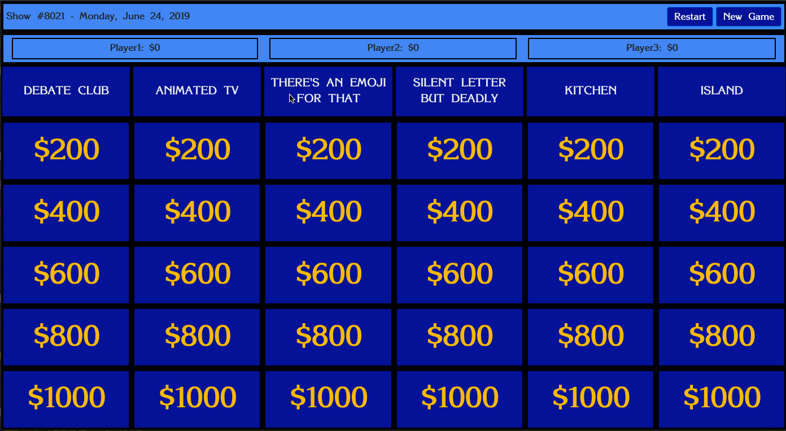

# jeppy

This is a little project that scrapes historical jeopardy questions/answers from [J! Archive](https://www.j-archive.com), dumps the
raw data to a json file, populates a sqlite database with that data, and provides a react app to play jeopardy using the
historical games.

> _NOTE_:
> This is a work in progress.



## Overview

- `scraper/`: contains scrapy project to get raw data and dump to json
- `backend/`: contains flask app to handle db operations
- `frontend/`: contains react app that fetches data, renders it, and handles gameplay

## Quick Start

Get started with development of jeppy by cloning the project
and serving the application locally.

### Configuration

Some basic configuration constants currently live in `frontend/client/src/consts.ts`.
We'll probably want to do configuration like this differently in the future but
for now it should serve our needs.

### Running Jeppy Locally

```shell
# Clone the repository
git clone https://github.com/ecshreve/jeppy.git

# Navigate to jeppy
cd jeppy

# Serve the application
task serve
```

#### Navigate to `http://localhost:3000` in a browser

## Taskfile

This project uses [Task](https://taskfile.dev/) to easily build and run the application. You
can [install Task here](https://taskfile.dev/#/installation). Task is a simple alternative to makefiles.

> List available tasks with `task -l`

### Usage

```shell
# task: Available tasks for this project:
* refresh:              Clean out the project
* scrape:               Gather new jeopardy data
* serve:                Serve UI and server
* serve:backend:        Serve backend Python app
* serve:frontend:       Serve React UI
* db:populate:          Load data from data/dump.json into the db
* db:migrate:           Create and apply db migration
```

## Backend

The `backend/` directory contains a Flask app to manage client communication with the database.

### Database Migrations

This project uses [Flask-Migrate](https://flask-migrate.readthedocs.io/en/latest/#) to manage
database migrations. After making a schema change in the application run `task migrate` to
apply the schema change to the database.

### Example game JSON

These are the results of one game of jeopardy
created by the application in JSON format.

```json
{
    "game_id": ["Show #3966 - Monday, November 26, 2001"],
    "category_J_1": ["SUDDENLY SUDAN"],
    "category_J_2": ["GOOD TOMES"],
    "category_J_3": ["STORE TREK"],
    "category_J_4": ["TREES COMPANY"],
    "category_J_5": ["MELROSE FACE"],
    "category_J_6": ["\"FOOL\" HOUSE"],
    "category_DJ_1": ["CLASSICAL MUSIC"],
    "category_DJ_2": ["UNIVERSITY STATE"],
    "category_DJ_3": ["ODDS & ENDS"],
    "category_DJ_4": ["AT THE MOVIES"],
    "category_DJ_5": ["HISTORIC TABLOID HEADLINES"],
    "category_DJ_6": ["PORTMANTEAU WORDS"],
    "category_FJ": ["WORLD CITIES"],
    "category_TB": ["WORLD CITIES"],
    "clue_ids": [
        "clue_J_1_1",
        "clue_J_2_1",
        "clue_J_3_1",
        "clue_J_4_1",
        "clue_J_5_1",
        "clue_J_6_1",
        "clue_J_1_2",
        "clue_J_2_2",
        "clue_J_3_2",
        "clue_J_4_2",
        "clue_J_5_2",
        "clue_J_6_2",
        "clue_J_1_3",
        "clue_J_2_3",
        "clue_J_3_3",
        "clue_J_4_3",
        "clue_J_5_3",
        "clue_J_6_3",
        "clue_J_1_4",
        "clue_J_2_4",
        "clue_J_3_4",
        "clue_J_4_4",
        "clue_J_5_4",
        "clue_J_6_4",
        "clue_J_1_5",
        "clue_J_2_5",
        "clue_J_3_5",
        "clue_J_5_5",
        "clue_J_6_5",
        "clue_DJ_1_1",
        "clue_DJ_3_1",
        "clue_DJ_4_1",
        "clue_DJ_5_1",
        "clue_DJ_6_1",
        "clue_DJ_1_2",
        "clue_DJ_3_2",
        "clue_DJ_4_2",
        "clue_DJ_5_2",
        "clue_DJ_1_3",
        "clue_DJ_3_3",
        "clue_DJ_4_3",
        "clue_DJ_5_3",
        "clue_DJ_1_4",
        "clue_DJ_2_4",
        "clue_DJ_3_4",
        "clue_DJ_4_4",
        "clue_DJ_5_4",
        "clue_DJ_1_5",
        "clue_DJ_2_5",
        "clue_DJ_3_5",
        "clue_DJ_4_5",
        "clue_DJ_5_5",
        "clue_FJ"
    ],
    "clues": [
        "From 1899 to 1956 Sudan was controlled by Egypt & this colonial power",
        "Characters in this Victor Hugo classic include the Bishop of Digne, Inspector Javert & Cosette",
        "Based in Atlanta, this chain for do-it-yourselfers is the world's largest home improvement retailer",
        "The yellow or silver type of this tree has peeling, papery bark when it's young",
        "Jake, played by Grant Show, made his debut on this series which took place in a different ZIP code",
        "Iron pyrite",
        "In 1995 this former U.S. president oversaw a ceasefire in Sudan to allow relief workers into war-torn areas",
        "(Cheryl of the Clue Crew is at the Plaza Hotel in New York City.)  This man's second novel, 1922's \"The Beautiful and Damned\", features scenes in the Plaza's Grill Room",
        "This \"City\" is \"Where Service is State-of-the-Art\"",
        "Trees of the genus Fraxinus are easily transplanted: these to these, dust to dust",
        "Kristin Davis' \"Melrose Place\" days had to help prepare her to play Charlotte on this HBO comedy",
        "The first day of the fourth month",
        "The Atbarah River joins this river in northern Sudan as its last tributary",
        "This 1929 antiwar novel begins, \"We are at rest five miles behind the front\"",
        "This store, a place for cooks, was founded by Chuck Williams in the 1950s",
        "Like Zeus, nymphs called Dryads were particularly associated with this mighty type of tree",
        "As Amanda on \"Melrose Place\", she was \"involved\" with Michael, Billy, Jake, Craig, Peter, Bobby, Kyle & Rory",
        "Proverbially, these 2 things \"are soon parted\"",
        "This Sudanese city of about 1 million was founded as an Egyptian army camp in the 1820s",
        "\"Byzantine Honeymoon\", \"The Towers of Trebizond\" & \"Midnight Express\" all take place in this country",
        "Head over to this \"Town\", the retail store of an athletic gear company, for its weekly running club",
        "It's the Asian tree-growing art represented here",
        "She dove into the \"Melrose\" pool in 1997 before she \"Charmed\" us as Phoebe in 1998",
        "It means designed to function despite human error",
        "Handling most of the country's foreign trade, Port Sudan lies on this sea",
        "In 1890 Oscar Wilde painted this novel portrait of a man trying to stay forever young",
        "The 59th & Lex Cafe is found in this department store that's found on 59th & Lex",
        "This uber-producer gave us \"Dynasty\", \"Melrose Place\", \"Charlie's Angels\" (& Tori)",
        "A song on \"Magical Mystery Tour\"",
        "After his oratorio \"Esther\" hit big in concert instead of drama form, he wrote others like it, including \"Messiah\"",
        "Elwood Edwards is the voice behind this 3-word phrase heard online an estimated 27 million times a day",
        "This 1985 hit starring Pee-Wee Herman was the first major feature film directed by Tim Burton",
        "328 B.C.:This Macedonian leader \"Needs to Conquer Drinking -- Kills Friend Cleitus in Rage!\"",
        "Lewis Carroll coined the term \"portmanteau word\", explaining how \"slithy\" combines these 2 words",
        "After his debut in his hometown of Naples in 1894, it was a fast climb to the top for this tenor",
        "(Cheryl of the Clue Crew is at the Santa Monica Pier.)  He was credited with shooting down 80 Allied planes before being shot down himself in April 1918",
        "In this \"Romantic\" action smash of 2000, Russell Crowe slays them in the Coliseum, he really slays them",
        "An 1854 headline might have read, \"It's a Crime-ea!\"  this 661-man group \"Decimated at Balaklava!\"",
        "Giuseppe Gazzaniga & this composer based their \"Don Giovanni\" operas on the same libretto",
        "The OED says the word \"word\" is from OE, this language",
        "(Sarah of the Clue Crew is at Sea World in San Diego.)  I'm not going to make a killer whale mad; I've seen this Richard Harris movie that came out 2 years after \"Jaws\"",
        "In the third century A.D. it was \"Martyr, She Wrote!\" when St. Cecelia defied this civilization's gods",
        "This Leoncavallo opera of 1892 has a Commedia Dell'Arte playlet within it",
        "Grambling State,Dillard,Tulane",
        "(Sarah of the Clue Crew reports from the San Diego Zoo.)  Commonly called woolfat, this substance obtained from the greasy coating on wool is used in cosmetics",
        "1992 Oscar winner with the line \"It's a hell of a thing killin' a man.  You take away all he's got and all he's ever gonna have\"",
        "The headline seen here reproached this medieval woman, then married to Louis VII of France",
        "This Beethoven piano concerto, Opus 73, sounds fit for more than a king",
        "Concordia,Lawrence,Marquette",
        "\"Night Ride Home\", which aired on February 7, 1999, was its 200th \"presentation\"",
        "This actor's standout roles in the German films \"Hanussen\" & \"Mephisto\" helped earn both films Oscar nominations",
        "When this 18-year-old became the emperor's second wife in 1810, headlines called her \"Napoleon Pastry!\"",
        "This capital city of 13 million located at 55.5 degrees north latitude is the most populous city in Europe"
    ],
    "correct_responses": [
        "England (Great Britain)",
        "Les Miserables",
        "Home Depot",
        "birch",
        "Beverly Hills, 90210",
        "fool's gold",
        "Jimmy Carter",
        "F. Scott Fitzgerald",
        "Circuit City",
        "ash",
        "Sex and the City",
        "April Fools' Day",
        "the Nile",
        "All Quiet on the Western Front",
        "Williams-Sonoma",
        "oak",
        "Heather Locklear",
        "a fool and his money",
        "Khartoum",
        "Turkey",
        "Niketown",
        "Bonsai",
        "Alyssa Milano",
        "foolproof",
        "the Red Sea",
        "The Picture of Dorian Gray",
        "Bloomingdale's",
        "Aaron Spelling",
        "\"The Fool on the Hill\"",
        "George Frideric Handel",
        "\"You've Got Mail!\"",
        "Pee-wee's Big Adventure",
        "Alexander the Great",
        "\"slimy\" & \"lithe\"",
        "Enrico Caruso",
        "The Red Baron",
        "Gladiator",
        "the Light Brigade",
        "Wolfgang Amadeus Mozart",
        "Old English",
        "Orca",
        "Rome",
        "Pagliacci",
        "Louisiana",
        "lanolin",
        "Unforgiven",
        "Eleanor of Aquitaine",
        "the \"Emperor Concerto\"",
        "Wisconsin",
        "Hallmark Hall of Fame",
        "Klaus Maria Brandauer",
        "Marie Louise",
        "Moscow"
    ]
}
```
